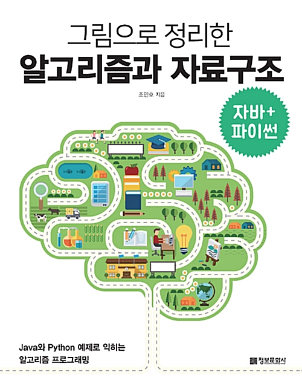
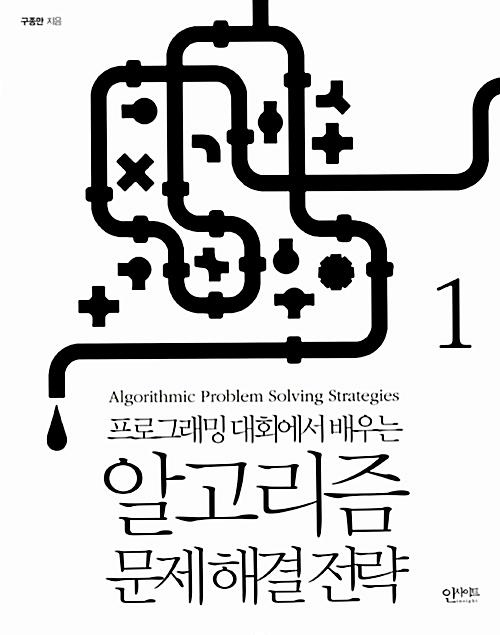

Study for Turnover

# **Algorithm and Data Structures**

Jeongwoo Lee

---
<!-- 
_class: lead  
_paginate: false
_backgroundImage: url('https://marp.app/assets/hero-background.jpg') 
-->

# ***Contents***
### 1. Introduction of Study Book
### 2. Next Plan
### 3. Algorithms

---
<!-- 
_class: lead  
_paginate: false
_backgroundImage: url('https://marp.app/assets/hero-background.jpg') 
-->

# **Introduction of Study Book**

---
# Intro
<!--책 정보-->
<!-- 책 그림 필요  -->

dkdkdk

---

# Reasons of Selection
<!--책을 선택한 이유와 목적-->

---
# Flow
<!--책 기본 설명 흐름-->

#### Study Schedule => 최대 2주 완성 예성

---
<!-- 
_class: lead  
_paginate: false
_backgroundImage: url('https://marp.app/assets/hero-background.jpg') 
-->

# **Next Plan**

---
# Advanced Algorithm
<!-- 파이썬 날코딩으로 알고 짜는 딥러닝/알고리즘 문제 해결 전략  -->

---
# Deep Learning with python

<!-- 파이썬 날코딩으로 알고 짜는 딥러닝/알고리즘 문제 해결 전략  -->

---
<!-- 
_class: lead  
_paginate: false
_backgroundImage: url('https://marp.app/assets/hero-background.jpg') 
-->

# **알고리즘**

---

