# 자료구조
## 연결 리스트

### 연결리스트 코드
* **python 코드**
```python
class Node : 
# 연결 리스트를 구성하는 단위 데이터의 모습은 데이터+다음 데이터 
	def __init__(self, data, next=None) : 
		self.data = data 
		self.next=next

def init() : 
# 연결리스트를 만듦. node1~4 그리고 연결포인터로 구성 
	global node1
	node1 = Node(1) 
	node2 = Node(2) 
	node3 = Node(3) 
	node4 = Node(4) 
	node1.next = node2 
	node2.next = node3 
	node3.next = node4

def delete(del_data) : 
# 구성된 리스트에서 데이터를 지우고 나머지를 연결
	global node1 
	pre_node = node1 
	next_node = pre_node.next 

	if pre_node.data == del_data : 
		node1 = next_node 
		del pre_node 
		return 

	while next_node : 
		if next_node.data == del_data: 
			pre_node.next = next_node.next 
			del next_node 
			break 
		pre_node = next_node 
		next_node = next_node.next

def insert(ins_data) : 
# 연결 리스트 추가 
	global node1 
	new_node = Node(ins_data) 
	new_node.next=node1 
	node1 = new_node

def print_list() : 
# 연결리스트 데이터 출력. 
	global node1 
	node = node1 
	while node: 
		print (node.data) 
		node=node.next 
	print()
def LinkedList() : 
	init(); 
	delete(2) 
	insert("9") 
	print_list()

# Main code
LinkedList() 

```

* **결과**
```결과
List: {5, 500.0}  {4, 400.0}  {3, 300.0}  {2, 200.0}  {1, 100.0}
deleted: {5, 500.0}
deleted: {4, 400.0}
deleted: {3, 300.0}
deleted: {2, 200.0}
deleted: {1, 100.0}
List: 
```

### 자료구조 활용 예시
> 이전에 자료구조를 통해 알고리즘이 활용되는지 보기 위한 예로 해쉬 테이블을 확인하도록 하자.

해쉬 테이블(Hash Table)은 데이터를 저장할 때, 저장할 위치를 해쉬 함수를 이용해서 생성하고 생성된 위치에 데이터를 저장하는 방식에서 사용하는 주소 테이블이다.

순서 리스트 + 연결 리스트 자료구조를 가지며, 데이터에 직접적인 접근이 가능하여 저장 및 읽기 속도가 빠르다. 그래서 데이터베이스에서 데이터를 저장할 때 주로 사용한다.

#### 해쉬테이블 저장 방법
데이터를 저장할때 해쉬 함수를 돌려서 나오는 배열 항목으로 저장하게됩니다.
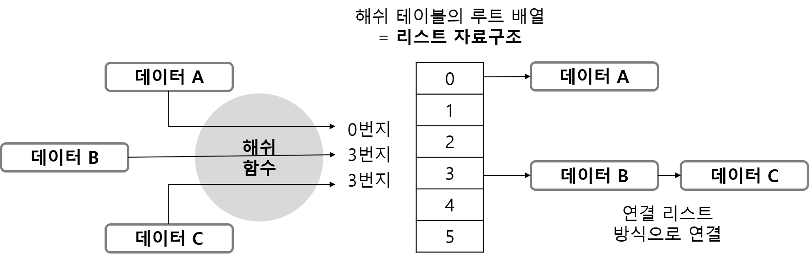

## 순서 리스트 자료구조
순서 리스트(Ordered List) 또는 선형 리스트(Linear List)는 리스트 기반의 자료 구조이다. 순서 리스트는 주로 인덱스 관리에 사용된다.

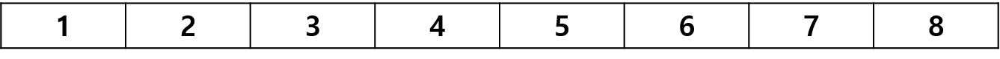

순서리스트는 리스트 기반의 자료 구조이기 때문에 중간의 자료를 삽입 또는 삭제시 전체의 크기가 변하는 것을 알 수 있음.
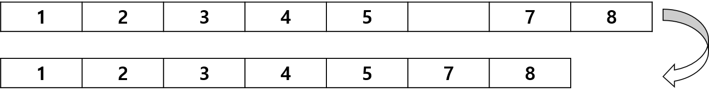
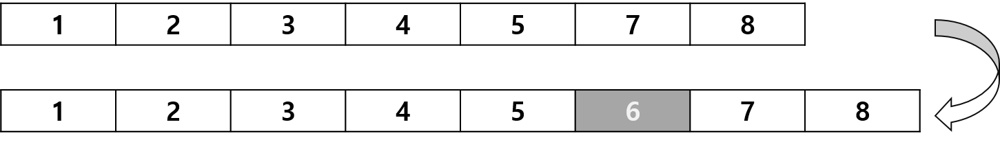

## 배열 자료구조
배열(Array)는 프로그램 언어 기능중에 가장 많이 사용되며, 동일한 형태의 자료를 연속해서 저장하는 구조를 가진다. 이때, 기본 자료형(int, double, bool 등)외에도 사용자 정의 자료형(구조체, 클래스 등)도 포함된다.

## 스택 자료구조
스택(Stack)은 데이터가 입력되면 입력되는 순서대로 쌓고, 나중에 들어온 것부터 먼저 사용하는 자룐구조이다 (LIFO; Last In First Out).
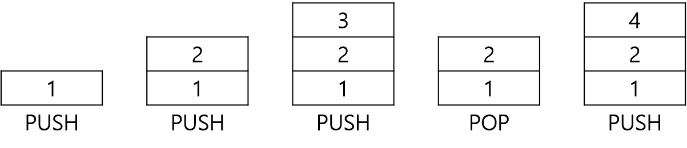

### 스택 용도
스택은 프로그램을 수행할 때 사용된다.

가령, 함수 A를 호출하여 실행할때, 함수 A 내의 함수 B가 호출되어 스택으로 쌓이게 된다.
함수 B의 실행이 완료되면 함수 A가 다시 실행되며 함수 A가 완료되면 프로그램이 실행된다.

### 스택 코드
* **python 코드**
```python
def Stack() : 
	stack = [] 

	stack.append(1) 
	stack.append(2) 
	stack.append(3) 
	stack.append(4) 
	stack.append(5) 
	print(stack) 

	while stack : 
		print("POP Value is ", stack.pop())
Stack()
```
* **결과**
```
[1, 2, 3, 4, 5]
POP Value is 5
POP Value is 4
POP Value is 3
POP Value is 2
POP Value is 1
```

### 컴퓨터가 사용하는 수식 방법(후위 표기법)
사람이 사용하는 수식(중위 표기법)을 컴퓨터가 사용하는 수식(후위 표기법)으로 변환하여 연산하는 과정을 알아보자.

```
K = ((A*B)+(C/D))
```
```
K = AB*CD/+
```

## 큐 자료구조
큐(Queue)는 데이터가 입력되면 입력되는 순서대로 쌓이고, 먼저 들어온 것부터 먼저 사용되는 자료구조이다 (FIFO; First In First Out). 
큐의 구현은 배열을 사용하거나 (순환 큐), 연결 리스트를 사용한다(링크드 큐).
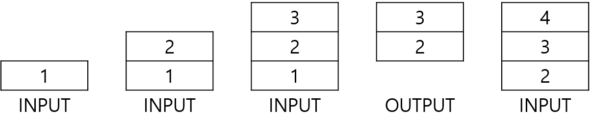

### 큐 용도
컴퓨터 내에서 여러 개의 프로세스가 수행중 일 경우, 새로운 프로세스가 수행되야한다면 기존에 수행되던 프로세스중 가장 먼저 올라온 프로세스를 내보낸다. 이를 운영체제가 큐의 형태로 관리하게된다.

### 큐 코드
* **python 코드**
```python
	def Queue() :
		queue = []
		queue.append(1)
		queue.append(2)
		queue.append(3)
		queue.append(4)
		queue.append(5)
		print(queue)
		while queue :
			print("Get Value :", queue.pop(0))
	Queue()
```
* **코드 결과**
```
	[1, 2, 3, 4, 5]
	Get Value : 1
	Get Value : 2
	Get Value : 3
	Get Value : 4
	Get Value : 5
```

## 데크 자료구조
데크(Deque) 자료구조는 많이 사용되지 않지만, 상당히 재밌는 구조이다. 데크는 리스트 양쪽 끝에서 삽입과 삭제가 모두 이루어지는 자료구조이며, 스택과 큐를 혼합한 구조형태이다. 

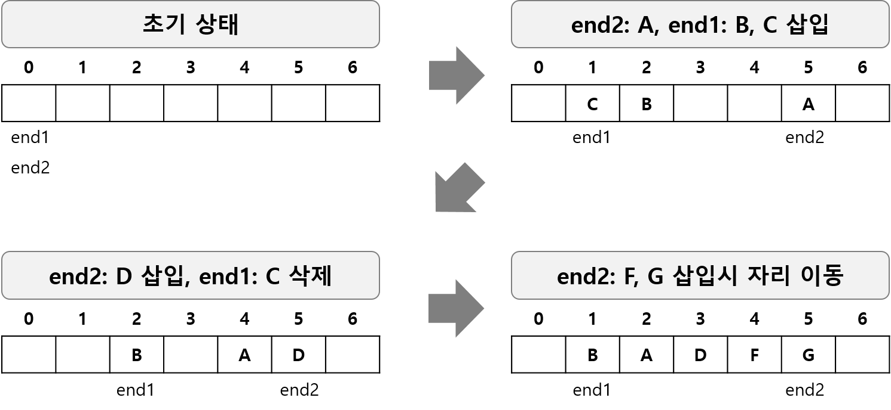

### 데크의 자료구조 종류
* 입력 제한 데크(스크롤): 삽입이 한쪽에서만 일어나는 데크
* 출력 제한 데크(셀프): 삭제가 한쪽에서만 일어나는 데크

## 트리 자료구조
임의의 노드에서 다른 노드로 가는 경로가 하나 밖에 없을 경우, 이를 트리 자료구조라고 한다. 트리 자료구조는 단 하나의 루트 노드(Root Node)가 있고, 루트노드에서 하위 노드(Sub Node)들이 연결된 비선형 계층 구조이다.

트리 자료구조의 구현은 배열이나 연결 리스트를 사용하며 운영체제의 파일 시스템에서 사용하고 있다.

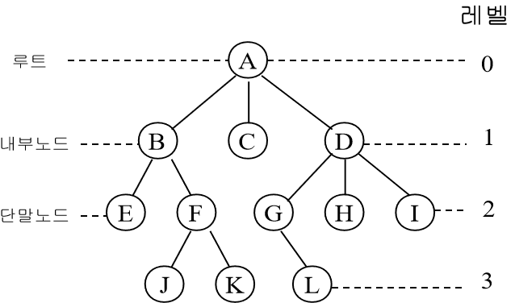

### 이진 트리
 이진 트리 구조(Binary Tree)는 트리 자료구조중에서 모든 노드가 최대 2개의 자식 노드를 가질 수 있는 구조이다. 이때, 왼쪽 서브 트리는 루트값보다 작고, 오른쪽 서브 트리는 루트 값보다 크게 구성된다. 주로 빠른 검색이 필요한 곳에 사용되며, **이진 검색 트리**라고 한다.

 #### 이진 트리의 분류
 * 포화 이진 트리(Full Binary Tree): 레벨의 노드가 꽉찬 트리
 * 완전 이진 트리(Complete Binary Tree): 마지막 레벨 전까지 노드가 꽉차있고, 마지막 레벨의 왼쪽에서 오른쪽으로 노드가 채워져 있는 트리(*마지막 레벨이 다 채워지지 않아도됨*)
 * 편향 이진 트리(Skewed Binary Tree): 왼쪽 또는 오른쪽 서브 트리만을 가지는 트리

 #### 사용 및 응용
*이진 트리 사용 알고리즘(입력, 검색, 삭제)*


만약 7을 입력할 경우,
1. 8보다 작기 때문에 왼쪽으로 이동
2. 3보다 크기 때문에 오른쪽으로 이동
3. 5보다 크기 때문에 오른쪽으로 이동

결과적으로 3-level에 위치하며, 부모노드 5의 오른쪽 자식노드로 위치하게 된다.

이와 같은 방식으로 특정 값을 찾는다.

만약, 특정값 (10)을 지우는 경우,
1. 9가 10의 자리로 이동
2. 19는 9보다 크기 때문에 오른쪽으로 이동

이때, 0-level인 8을 지울 경우, 3과 10 중 하나를 후계자로 놓고, 나머지 노드의 값들은 삽입하는 방식으로 재배치하게 된다.

 #### 응용 사례 및 구현 방법
* 이진 트리를 수식으로 표현 하는 경우

`1*2+(7-8)`에 대한 이진 트리 표현은 다음과 같다.

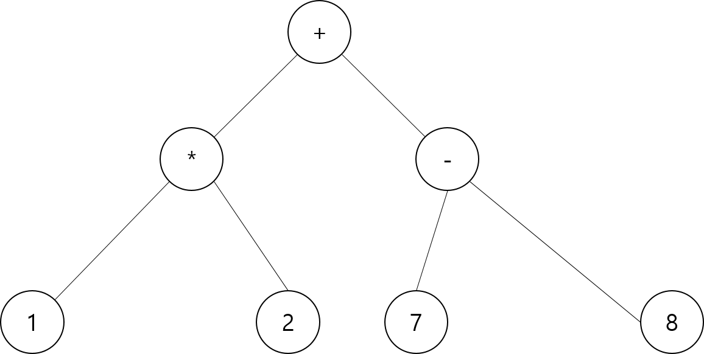

* 이진 트리를 컴퓨터로 구현하는 방식

다음과 같은 이진 트리를 컴퓨터로 구현할 경우,

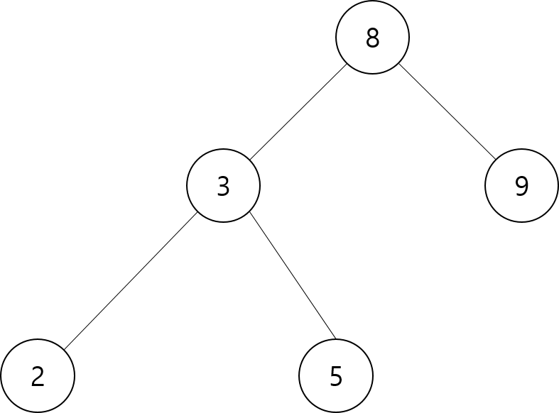

  1. 순차 자료구조방식
  2. 연결 자료구조방식

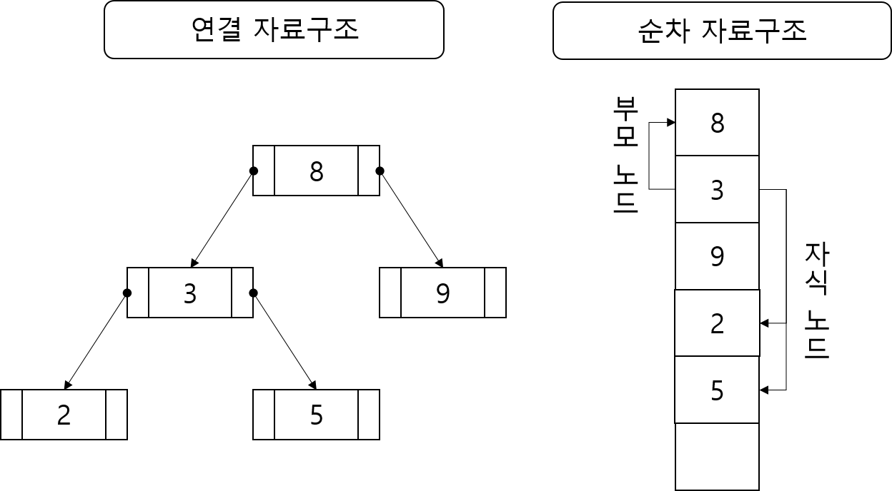


 #### 이진 트리 코드
 * **python 코드**
```python
	class Node(object): 	# ����� ������ �����ϴ� �κ� 
		def _ _init_ _(self, data): 
			self.data = data 
			self.left = self.right = None

	class BinarySearchTree(object) : 
		def _ _init_ _(self): 
			self.root = None 

		def insert(self, data): # ���� Ʈ���� �����͸� �ִ� �κ� 
			self.root = self._insert_value(self.root, data) 
			return self.root is not None 
		
		def _insert_value(self, node, data) : 
			if node is None : 
				node = Node(data) 
			else : 
				if data <= node.data: 
					node.left = self._insert_value(node.left, data) 
				else : 
					node.right = self._insert_value(node.right, data) 
			return node 

		def find(self, key): # ���� Ʈ������ �����͸� ã�� �κ� 
			return self._find_value(self.root, key) 

		def _find_value(self, root, key): 
			if root is None or root.data ==key: 
				return root is not None 
			elif key < root.data: 
				return self._find_value(root.left, key) 
			else : 
				return self._find_value(root.right, key)

		def delete(self, key) : # ���� Ʈ������ �����͸� ����� �κ� 
			self.root, deleted = self._delete_value(self.root, key) 
			return deleted
			
		def _delete_value(self, node, key) :
			if node is None : 
				return node, False 

			deleted=False 
			if key == node.data : 
				deleted = True 
				if node.left and node.right : 
					parent, child = node, node.right 
					while child.left is not None : 
						parent, child = child, child.left 
					child.left = node.left 
					if parent != node: 
						parent.left=child.right 
						child.right = node.right 
					node = child 
				elif node.left or node.right : 
					node = node.left or node.right 
				else: 
					node = None 
			elif key < node.data: 
				node.left, deleted = self._delete_value(node.left, key) 
			else : 
				node.right, deleted = self._delete_value(node.right, key) 
			return node, deleted 
		
		def DFTravel(self): # �����͸� ����ϴ� �κ� 
			def _DFTravel(root): 
				if root is None: 
					pass 
				else : 
					print(root.data, end=' ') 
					_DFTravel(root.left) 
					_DFTravel(root.right) 
				_DFTravel(self.root) 
			def LFTravel(self): # �����͸� ����ϴ� �κ� 
				def _LFTravel(root) : 
					if root is None : 
						pass
					else: 
						_LFTravel(root.left) 
						print(root.data, end=' ') 
						_LFTravel(root.right) 
				_LFTravel(self.root) 

		def LRTravel(self): # �����͸� ����ϴ� �κ� 
			def _LRTravel(root) : 
				if root is None: 
					pass 
				else : 
					_LRTravel(root.left) 
					_LRTravel(root.right) 
					print(root.data, end=' ') 
			_LRTravel(self.root) 

		def layerTravel(self): # �����͸� ����ϴ� �κ� 
			def _layerTravel(root) : 

				queue = [root] 
				while queue : 
					root = queue.pop(0) 
					if root is not None : 
						print(root.data, end=' ') 
						if root.left : 
							queue.append(root.left) 
						if root.right: 
							queue.append(root.right) 
			_layerTravel(self.root)
```

 * **결과**
 ```
	True
	False
	True
	True
	False

	@@@@@@@
	20 8 7 12 9 32 32 65
	=====
	7 8 9 12 20 32 32 65
	*****
	7 9 12 8 32 65 32 20
	&&&&&
	20 8 32 7 12 32 65 9
 ```

 ### 트리구조의 응용 (Heap)
 트리 자료구조의 활용 예로서 힙(Heap)을 보자.

 힙은 컴퓨터 분야에서 두가지 의미로 사용된다.
 하나는 이번에 설명할 것이며, 다른 하나는 컴퓨터에서 프로세스가 만들어졌을때, 메모리를 할당하게 되는데 이 방법이 *Stack*과 *Heap*이다.

 이번에 설명하는 힙은 이진 트리의 일종으로, 여러가지 값중에서 가장 큰 값과 가장 작은 값을 빠르게 찾을 수 있는 자료구조이다.
 * 최소 힙(Min Heap): 부모노드의 값이 항상 하위 노드의 값보다 작은 경우
 * 최대 힙(Max Heap): 부모노드의 값이 항상 하위 노드의 값보다 큰 경우

 힙은 배열을 사용하는 경우가 일반적이다.


**최대 힙**

 최대 힙은 데이터로 구성된 이진 트리의 가장 큰 값이 최상위 노드에 위치한 것을 말한다.

**힙 사용 예**
시스템에서 여러 프로세스가 수행되고 있고, 각 프로세스의 우선순위를 결정하는 방법으로 힙을 사용하는 경우.
* 우선순위가 부여된 프로세스를 최대 힙으로 구성
* 프로세스 요청시, 최상위 노드 반환
* 최상위노드(루트노드) 반환시, 나머지 노드를 우선순위 숫자에 근거하여 트리 구조 재구성

**최대 힙에서의 삽입과 삭제**
* *삽입*: 최하위 노드로 삽입하며 부모노드보다 클경우 부모노드와 위치를 교환해가며, 자리를 찾는다.
* *삭제*: (루트노드 삭제시) 맨 마지막 노드를 루트노드로 하여 삽입과정과 동일하게 트리 구조 재구성


## 그래프 자료구조
그래프(Graph) 자료구조는 자료구조에 포함시키는 것은 모호한 면이 있지만, 많은 책에서 자료구조로 소개된다.

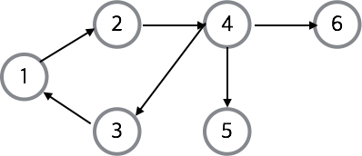

그래프는 2개 이상의 항목이 어떤 관계를 맺고 있는지를 노드(정점)와 엣지(선)를 이용하여 표현한 것이다.

페이스북이나 트위터같은 SNS에서 사용자가 다른 사용자와 어떤관계인지를 표현하는 경우가 대표적인 예이다.

### 그래프의 용어
* 그래프는 `깊이 우선 탐색`과 `너비 우선 탐색`이 사용됨.
  * 깊이 우선 탐색(*DFS: Depth First Search*): 시작 정점에서 한 방향으로 갈 수 있는 가장 먼 경로까지 탐색하다가 갈 곳이 없으면, 가장 마지막에 만났던 부모 노드로 돌아와서 다른 방향을 탐색하는 방법
  * 너비 우선 탐색(*BFS: Breadth First Search*): 시작 정점에서 인접한 모든 정점들을 우선 방문한 후, 더이상 방문하지 않은 정점이 없을때 방문했던 정점들을 시작점으로 인접한 모든 정범을 방문하는 방법

* *신장 트리*: 그래프 안의 모든 정점을 포함하는 트리; 모든 정점들이 연결되어 있어야 하고 **사이클은 포함하지 않음.**

* *최소 비용 신장 트리*: 가중치가 부여된 무방향 그래프에서 신장 트리 비용의 최소화를 구하는 방법
  * *Prim 방법*
    1. 시작하는 노드에 연결되는 것중에서 가중치가 최소인 노드를 선정
	2. 선정된 노드에 연결된 것 중에서 가중치가 최소인 것을 선정
	3. 이어진 노드에서 최솟값을 계속해서 선정하는 방법
  * *Kruskal 방법*
    1. 전체 그래프를 보고 최소 가중치를 선정
	2. 그 다음 최소 가중치를 가지는 것을 선정
	3. 선정할때, 사이클을 구성할 경우 제외.
	4. 동일한 것이 여러개 있으면 임의의 것을 선정
* 그래프를 사용하는 대표적인 방법
  * *PERT/CPM* 
    * *Program Evaluation and Review Technique / Critical Path Method*는 비용을 적게 사용하면서 최단 시간 안에 계획을 완성하기 위한 프로젝트 일정 관리 기법
  * *최단 경로*
    * 그래프에서 정점 a, b를 연결하는 경로 중에 가중치의 합이 최소가 되는 경로를 찾는 방법
	* 데이크스트라(Dijkstra) 알고리즘이 대표적

### 그래프 구현 알고리즘
그래프는 배열과 연결 리스트를 이용하면된다.

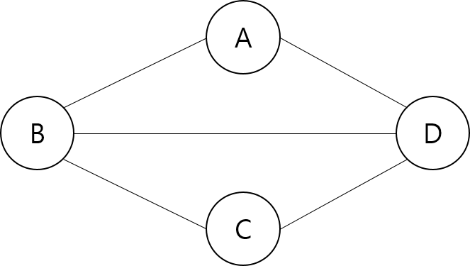

위 그래프에 대해서 순차 자료구조와 연결 자료구조로 표현하면 다음과 같다.

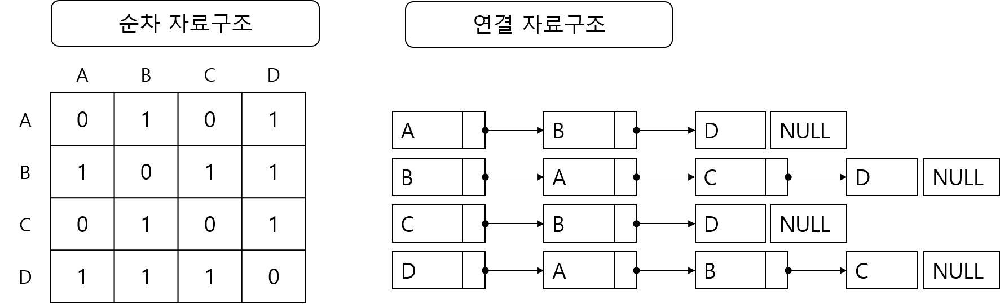


# 정렬 알고리즘

> 정렬 알고리즘은 오름차순 또는 내림차순에 따라 순서를 재배치하는 알고리즘

## 종류
* 버킷 정렬(Bucket Sort)
* 선택 정렬(Selection Sort)
* 삽입 정렬(Insert Sort)
* 병합 정렬(Merge Sort)
* 힙 정렬(Heap Sort)
* 기수 정렬(Radix Sort)
* 교환 정렬(Exchange Sort)
* 셀 정렬(Shell Sort)
* 퀵 정렬(Quick Sort) - C언어 표준 라이브러리에서 제공

## 버컷 정렬 알고리즘
버킷 정렬(Bucket Sort)는 버킷이라는 단위 기억 장소에 정렬하고 버킷별 키값에 따라 다시 정렬하는 알고리즘
1. 정렬할 데이터를 확보
2. 정렬할 데이터 숫자 이상의 공간을 확보 -> 숫자에 해당하는 공간에 차례대로 할당
3. 데이터를 각자 위치에 삽입
4. 배열을 처음부터 읽어서 출력

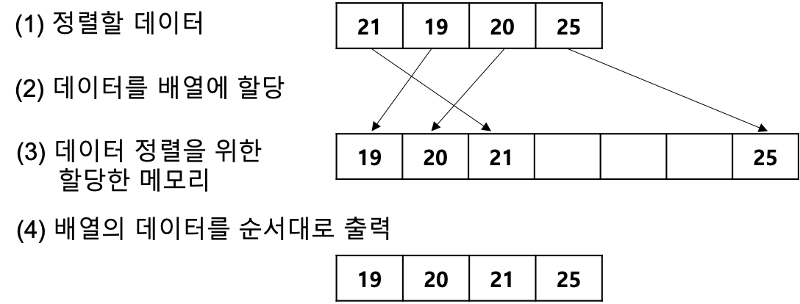

## 기수 정렬 알고리즘
기수 정렬(Radix Sort)는 버킷 정렬에서 데이터의 모양에 따른 제한이 있는 것을 개선한 정렬이다. 이것은 각 자릿수별로 버킷 정렬을 반복 수행하는 방법이다.

기수 정렬 알고리즘은 간단하며, 버킷 정렬보다 시스템 자원의 낭비가 적으며, 빠르게 정렬할 수 있기때문에 활용도가 높다.

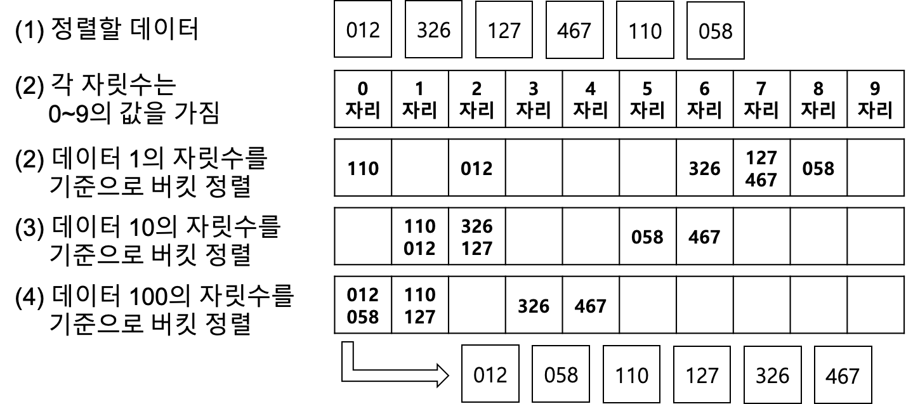

### 코드
* **python 코드**
```python
	def radix(order):
		is_sorted = False
		position = 1

		while not is_sorted:
			is_sorted = True
			queue_list = [list() for _ in range(10)]

			for num in order:
				digit_number = (int) (num/position) % 10
				queue_list[digit_number].append(num)
				if is_sorted and digit_number > 0:
					is_sorted = False
			index = 0

			for numbers in queue_list:
				for num in numbers:
					order[index] = num
					index +=1
			position *=10

	x = [5,2,8,6,1,9,3,7]
	radix[x]
	print[x]
```

* **결과**
```
	1, 2, 3, 5, 6, 7, 8, 9
```

## 선택 정렬 알고리즘
선택 정렬(Selection Sort) 알고리즘은 가장 작은 데이터를 찾아서 가장 앞 데이터와 교환하는 알고리즘이다.
1. 데이터 중 가장 작은 것을 찾아서 처음에 있는 것과 위치를 교환
2. 두번째부터 마지막까지의 데이터 중에서 가장 작은 것과 찾아 두번째와 위치 교환
3. 위 과정 반복

### 코드
* **python 코드**
```python
	def change(x, i, j):
		x[i], x[j] = x[j], x[i]

	def selectionSort(x):
		for size in reversed(range(len(x))):
			max_i = 0
			for i in range(1, 1+size):
				if x[i] > x[max_i]:
					max_i = i
			change(x, max_i, size)

	x = [5,2,8,6,1,9,3,7]
	selectionSort(x)
	print(x)
```

* **결과**
```
	1,2,3,5,6,7,8,9
```

## 교환 정렬 알고리즘
교환 정렬(Exchange Sort) 알고리즘은 작은 것부터 큰 순서로 정렬할 경우, 작은 키를 갖는 데이터를 찾아 앞 데이터와 교환하는 알고리즘이다.
1. 정렬할 데이터를 대상으로 앞에서부터 인접한 두 개의 크기를 비교하여 작은 것이 앞으로 가도록 교환
2. 나머지 데이터도 비교해가면서 계속 교환
3. 끝까지 수행후 다시 처음부터 동일한 작업 반복
4. 큰 수에서 작은 수로 정렬하고 싶으면 반대로 적용.

### 코드
* **python 코드**
```python
	def mergeSort(x):
		if len(x) > 1:
			mid = len(x) // 2
			colx, rowx = x[:mid], x[mid:]
			mergeSort(colx)
			mergeSort(rowx)

			coli, rowi, i = 0,0,0
			while coli < len(colx) and rowi < len(rowx):
				if colx[coli] < rowx[rowi]:
					x[i] = colx[coli]
					coli +=1
				else:
					x[i] = rowx[rowi]
					rowi +=1
				i +=1
			x[i:] = colx[coli:] if coli != len(colx) else rowx[rowi:]

	x = [5,2,8,6,1,9,3,7]
	mergeSort(x)
	print(x)
```

* **코드**
```
	1,2,3,5,6,7,8,9
```

## 삽입 정렬 알고리즘
삽입 정렬(Insert Sort) 알고리즘은 교환 정렬 알고리즘과 비슷하다. 다른 점은 위치 교환이 발생되면, 발생된 대상자 주변것과 계속해서 비교하게된다.

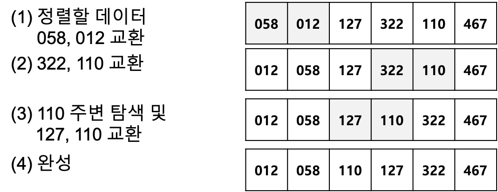

### 코드
* **python 코드**

```python
	def insertSort(x):
		for size in range(1, len(x)):
			val = x[size]
			i = size

			while i>0 and x[i-1] > val:
				x[i] = x[i-1]
				i -=1
			x[i] = val

	x = [5,2,8,6,1,9,3,7]
	insertSort(x)
	print(x)
```

```
	1,2,3,5,6,7,8,9
```

## 쉘 정렬 알고리즘
쉘 정렬 알고리즘(Shell Sort)